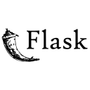

# Olá! Eu sou Mateus Fenoci 👋

## Sobre mim

- 📊 **Software Engineer** com foco em Back-end e GenAI.
- 📚 Atualmente estou estudando **algoritmos**, **estruturas de dados** e bibliotecas como: Spring Boot, Django, FastAPI, entre outras.
- 🎯 Gosto de resolver problemas complexos com dados e aprender constantemente novas tecnologias.

  
  

---

## 🛠️ Tecnologias e Ferramentas

 
  
  
  
  
  
  
  
  
  
  

---

## 🌱 Em aprendizado contínuo

Atualmente focado em aprender mais sobre:
- Algoritimos e Estruturas de Dados
- Java & Spring
- Bancos de Dados Relacionais
- Langchain e LLM's

---
