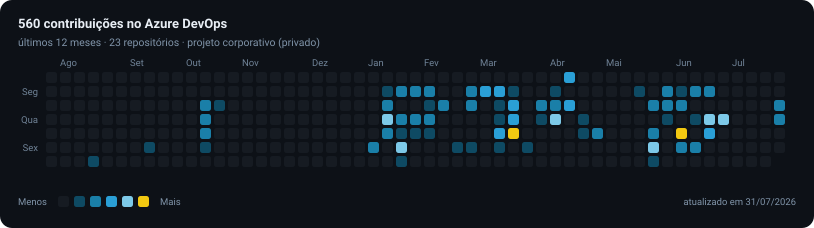

 

 
 

 

## Sobre

Engenheiro de Dados em **Suprimentos/Logística na ArcelorMittal Brasil** (via Vixteam), construindo
pipelines de dados em produção no setor siderúrgico. Também toco a **NextData**, minha empresa de
engenharia de dados.

 

## Certificação

<table>
  <tr>
    <td width="150" align="center">
      
    </td>
    <td>
      <strong>Databricks Certified Data Engineer Associate</strong>
       
      Emitida pela Databricks · credencial oficial verificável
        
      Cobre ingestão e transformação com Spark SQL e PySpark, arquitetura medalhão,
      Delta Lake, orquestração de pipelines e governança no Unity Catalog — a mesma
      stack que eu opero em produção no dia a dia.
        
      <a href="https://www.credential.net/1f5dbd25-95d2-4ff3-8024-f93a0312da39" target="_blank">Validar credencial &#8594;</a>
    </td>
  </tr>
</table>

 

 

### O pipeline que eu construo e opero

 

 

---

 

## O que eu faço

- **Lakehouse e ELT** — ingestão de mais de 20 fontes no lake (SAP ECC/BW, REST, SOAP, SFTP, SCADA, SharePoint), com contratos de schema versionados e frameworks parametrizados, em vez de um pipeline novo a cada tabela.
- **Modelagem em camadas** — arquitetura medalhão em Delta Lake, com rastreabilidade de linhagem entre views.
- **PySpark e SQL em escala** — transformação, deduplicação, reconciliação de fontes divergentes.
- **Engenharia de software aplicada a dados** — Azure DevOps (repos, PRs, pipelines YAML), Git flow, code review.
- **Qualidade de dado** — validar preenchimento e semântica antes do join.

 

 

## Stack

 
 

 

 

---

 

## Ordem de grandeza do ambiente que opero

| | |
|:--|:--|
| **Fontes integradas** | **20+** — SAP ECC/BW, REST, SOAP, SFTP, SCADA, SharePoint |
| **Tabelas Delta que mantenho** | **~400**, em dezenas de schemas |
| **Camadas** | bronze / silver / gold em múltiplos catálogos Unity Catalog |
| **Volume processado pelos pipelines que construo** | **+150 bilhões** de linhas · **+10 TB** |
| **Commits (12 meses)** | **~600** em mais de 20 repositórios |
| **Pull requests mergeados** | **~80** no último ano |
| **Itens de backlog entregues** | **300+** entre Features, User Stories e Tasks |

Números arredondados, em ordem de grandeza.

 

---

 

### Atividade real de engenharia — Azure DevOps

 

Commits em repositório corporativo privado — não aparecem no gráfico público do GitHub.
Extraído da API do Azure DevOps e atualizado automaticamente todo mês.

 

 

